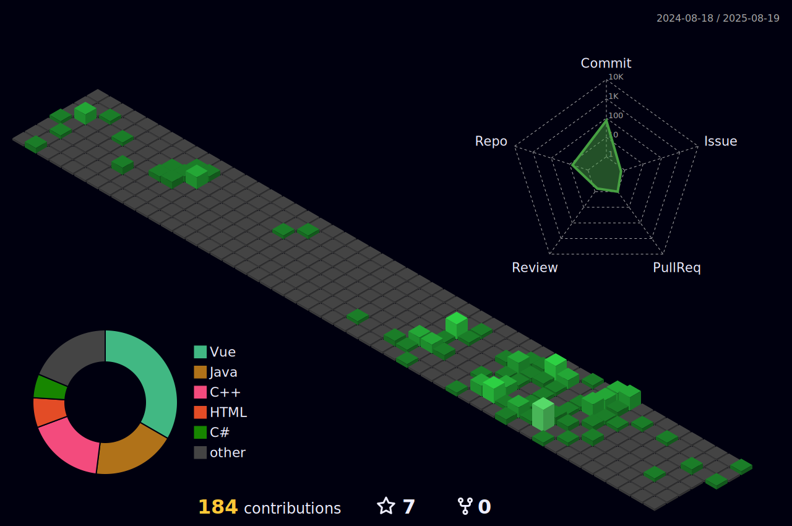

# Hi, I'm Luis Fernando Oliveira Belato | **Full-Stack Developer**

## Current Work
Developing payment method for online store.

## Professional Background
- **Development** - JavaScript, TypeScript, PHP, SolidJS, Docker, MySQL, Python, Java, mongoDB
- **Tools** -  Google Colab, MySQL Workbench, Git, Monday (WorkFlow Software), Swagger

## Currently Learning
- Exploratory Data Analysis & Data Science

## How to Reach Me

## Technical Skills
| Category        | Technologies                                  |
|-----------------|-----------------------------------------------|  
| **Analytics**   | Python, Pandas                                |
| **Backend**     | Node.js, TypeScript, Java (SpringBoot), C#    |
| **Frontend**    | React, Solid.Js, JQuery, Vue.js               |

## WakaTime Coding Activity
##### Total Time

## Something More **MERIT CERTIFICATES (Among the Top 5 Averages):**

* 1st Term - 5th Place 
* 2nd Term - 2nd Place
* 3rd Term - 1st Place
* 4th Term - 2nd Place
* 5th Term - 1st Place
* 6th Term - 1st Place

<h3 align="left">Languages and Tools:</h3>

                   

   

